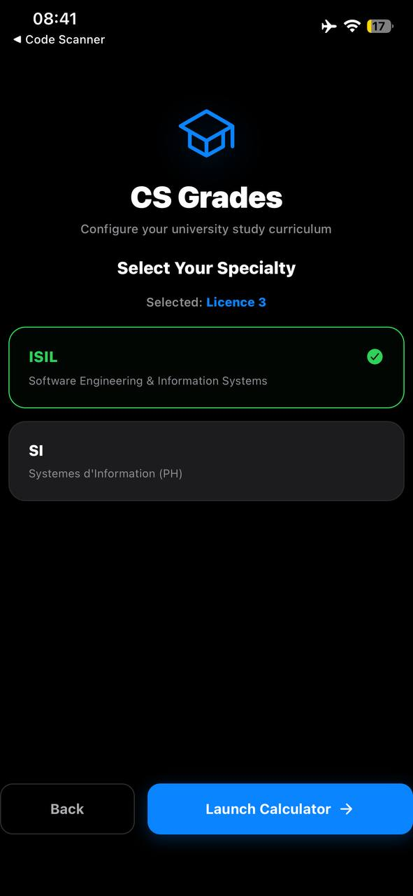
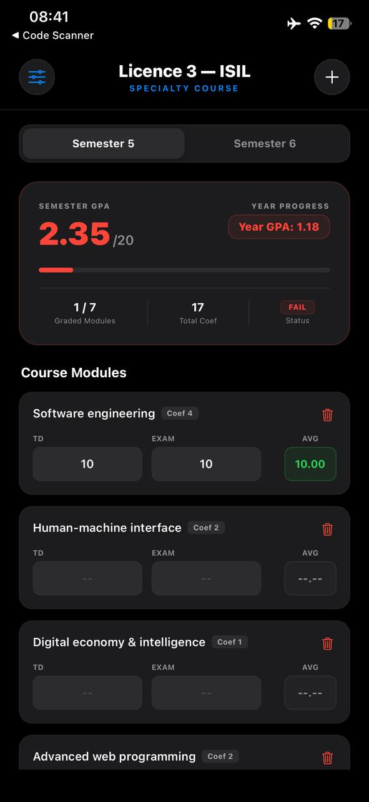

# CS-GRADES 🎓

A premium, native iOS & Android application built with React Native and Expo (SDK 54) to help Computer Science students easily manage their curriculum, track their progress, and dynamically calculate their SGPAs/CGPA. 

Featuring a sleek, true-black OLED dark interface with dynamic haptic-feeling transitions, the app persists progress locally so students never lose their data.

<div align="center">
  
  &nbsp;&nbsp;&nbsp;&nbsp;
  
</div>

---

## ✨ Features

- **🎓 Smart Curriculum Wizard**: Onboard by choosing your academic year and specialty, rendering a tailored grade environment without visual clutter.
- **⚡ Dynamic Calculations**: SGPA and CGPA update in real-time as you type. Empty grades are treated as `0` automatically to show a realistic running average.
- **💾 Auto-Save Persistence**: Integrates robust `AsyncStorage` to seamlessly save grades and preserve the last visited screen between sessions.
- **➕ Custom Module Additions**: Add custom subjects dynamically with customizable coefficient/credits, perfectly tailored to your custom academic path.
- **🌑 True-Black OLED UI**: Sleek, elegant dark design with high contrast, modern typography, and subtle micro-animations for high-fidelity native feel.

---

## 🛠️ Project Structure

The project has been modularized and decoupled for maximum maintainability:

```text
CS-GRADES/
├── assets/                  # App icons and media assets
├── src/
│   ├── components/
│   │   ├── CurriculumSelector.js  # Year and Specialty onboarding screen wizard
│   │   ├── SummaryCard.js         # SGPA/CGPA live metrics display
│   │   ├── SubjectCard.js         # Responsive grades input list
│   │   └── CustomModuleModal.js   # Dynamic custom subject insertion modal
│   └── database/
│       └── curriculum.js          # Preloaded official computer science syllabus
├── App.js                   # Main application navigation router & main layout
├── index.js                 # App entry point
└── package.json             # Dependencies and scripts
```

---

## 🚀 Getting Started

Follow these steps to run the application locally on your machine or test it on a physical device.

### Prerequisites

Ensure you have [Node.js](https://nodejs.org/) installed (v18+ recommended).

### Installation

1. **Clone the Repository**:
   ```bash
   git clone https://github.com/yourusername/CS-GRADES.git
   cd CS-GRADES
   ```

2. **Install Dependencies**:
   Install the standard package list using `npm`:
   ```bash
   npm install
   ```
   *Note: If you run into dependency conflicts on React 19 dependencies, run:*
   ```bash
   npm install --legacy-peer-deps
   ```

### Running the App

Start the Expo Metro Bundler server:
```bash
npx expo start
```

- **iOS**: Press `i` to open in the simulator, or scan the QR code using the Expo Go app.
- **Android**: Press `a` to open in the emulator, or scan the QR code using the Expo Go app.
- **Clear Metro Cache** (if upgrading/changing packages):
  ```bash
  npx expo start -c
  ```

---

## 📝 License

This project is licensed under the MIT License - see the [LICENSE](LICENSE) file for details.
